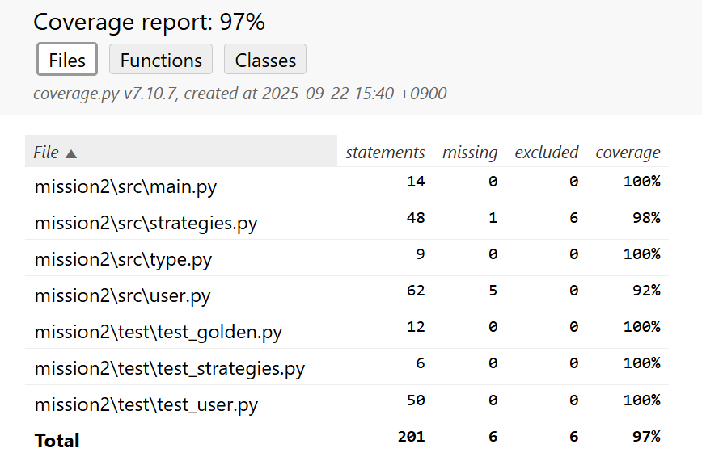
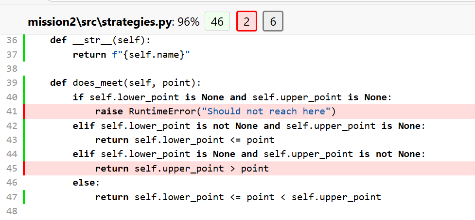
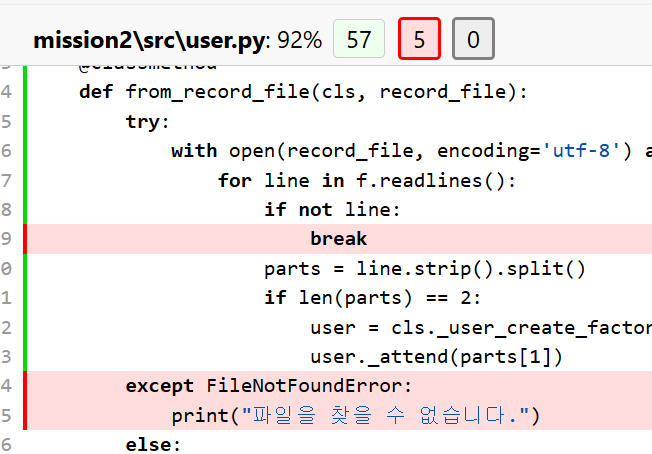
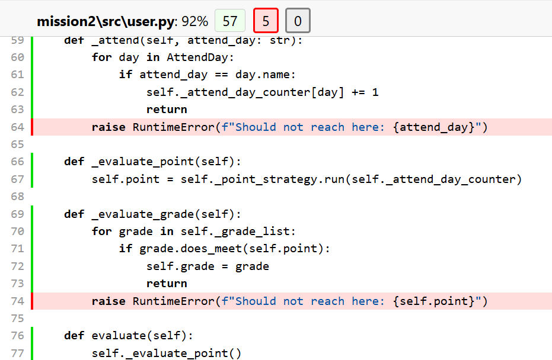

# CRA-common-project

## 체크리스트
|체크| 결과 |
|-|----|
|D1| O  |
|D2| O  |
|D3| O  |
|D4| O  |
|D5| O  |

메소드 레벨   
D1 - 가독성있는 코드로 메서드 추상화, 가독성 좋은 네이밍 사용
* [mission1 완료](./mission1/src)

클래스 레벨 리팩토링   
D2 - Regression Test를 위한 Unit Test 개발   
* [test 폴더](./mission2/test)에 Unit 및 End2End 테스트 개발
D3 – 확장성을 고려한 설계, 정책과 등급이 추가되더라도 Client Code에 변경이 없도록 한다.
* [Cliend Code](./mission2/src/main.py)는 추상화된 흐름만 있어, 변경이 없음

디자인 패턴 사용하기   
D4 - 리팩토링에 디자인 패턴을 적용한다.
* [User 클래스 생성](./mission2/src/user.py)에 팩토리 패턴 적용
* [Point 계산 클래스](./mission2/src/strategies.py)에 전략 패턴 적용

코드 커버리지 100%   
D5 - 리팩토링이 끝난 코드에, 코드 커버리지가 100% 되어야 한다.

92%, 96%는 도달하면 안되는 영역

[stragegies.py](./mission2/src/strategies.py) 45번째 줄은 현재 사용하지 않는게 맞으나 미리 구현함

